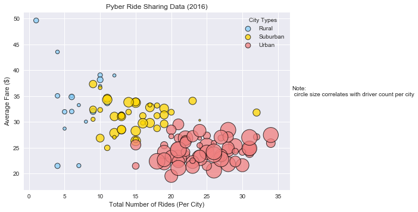
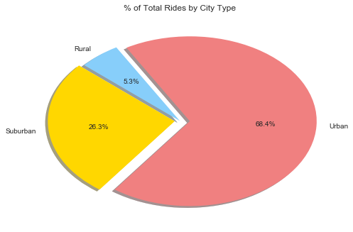
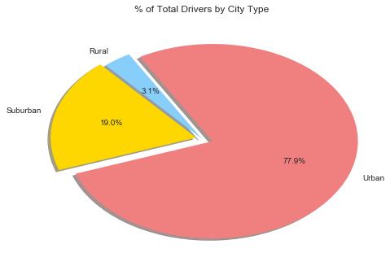
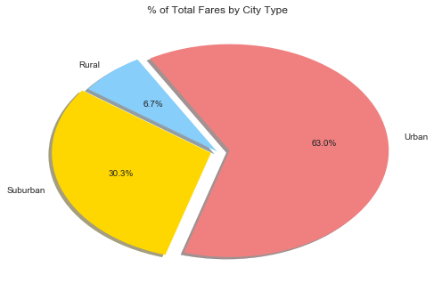

# Pyber HW Observed Trends:
1. Urban cities tend to have the most number of rides followed by suburban and rural populations, with the driver count per city following that same trend.
2. Rural areas have seen the greatest amount of dispersion with respect to the average fare per ride, which is probably due to a lower population density and thus longer trips between places of interest.
3. 78% of all drivers are located in urban areas while only 68% of the total rides take place in urban areas - suggesting that competition for rides in a big city is tougher than in smaller suburban or rural areas. This is supported by urban areas accounting for only 63% of all fares. It seems that the driver market in suburbia is undersupplied while the driver market in urban areas is oversupplied - while suburban drivers made up 19% of the whole, the same area accounted for 30% of all fares which ends up in a higher average fare per driver.   


```python
import matplotlib.pyplot as plt
import numpy as np
import pandas as pd
import matplotlib as mpl
```


```python
# Read data
city_data = pd.read_csv('raw_data/city_data.csv')
ride_data = pd.read_csv('raw_data/ride_data.csv')
```


```python
# Remove duplicate port james
city_data.loc[city_data['city'] == 'Port James']
city_data.drop_duplicates(subset='city', keep='first', inplace=True)
city_data.loc[city_data['city'] == 'Port James']
```


<div>
<style>
    .dataframe thead tr:only-child th {
        text-align: right;
    }

    .dataframe thead th {
        text-align: left;
    }

    .dataframe tbody tr th {
        vertical-align: top;
    }
</style>
<table border="1" class="dataframe">
  <thead>
    <tr style="text-align: right;">
      <th></th>
      <th>city</th>
      <th>driver_count</th>
      <th>type</th>
    </tr>
  </thead>
  <tbody>
    <tr>
      <th>84</th>
      <td>Port James</td>
      <td>15</td>
      <td>Suburban</td>
    </tr>
  </tbody>
</table>
</div>


```python
# Create new data frame with avg fare, total rides, driver count, and type by city
ride_data_group = ride_data.groupby('city').mean()['fare']
ride_data_group = pd.DataFrame(ride_data_group)
ride_data_group.columns = ['Avg Fare']
ride_data_group
total_rides = ride_data.groupby('city').count()['ride_id']
ride_data_group['Total Rides'] = total_rides
city_data_reset_index = city_data.set_index('city')
merged = pd.merge(ride_data_group, city_data_reset_index, left_index=True, right_index=True)
merged
```


<div>
<style>
    .dataframe thead tr:only-child th {
        text-align: right;
    }

    .dataframe thead th {
        text-align: left;
    }

    .dataframe tbody tr th {
        vertical-align: top;
    }
</style>
<table border="1" class="dataframe">
  <thead>
    <tr style="text-align: right;">
      <th></th>
      <th>Avg Fare</th>
      <th>Total Rides</th>
      <th>driver_count</th>
      <th>type</th>
    </tr>
    <tr>
      <th>city</th>
      <th></th>
      <th></th>
      <th></th>
      <th></th>
    </tr>
  </thead>
  <tbody>
    <tr>
      <th>Alvarezhaven</th>
      <td>23.928710</td>
      <td>31</td>
      <td>21</td>
      <td>Urban</td>
    </tr>
    <tr>
      <th>Alyssaberg</th>
      <td>20.609615</td>
      <td>26</td>
      <td>67</td>
      <td>Urban</td>
    </tr>
    <tr>
      <th>Anitamouth</th>
      <td>37.315556</td>
      <td>9</td>
      <td>16</td>
      <td>Suburban</td>
    </tr>
    <tr>
      <th>Antoniomouth</th>
      <td>23.625000</td>
      <td>22</td>
      <td>21</td>
      <td>Urban</td>
    </tr>
    <tr>
      <th>Aprilchester</th>
      <td>21.981579</td>
      <td>19</td>
      <td>49</td>
      <td>Urban</td>
    </tr>
    <tr>
      <th>Arnoldview</th>
      <td>25.106452</td>
      <td>31</td>
      <td>41</td>
      <td>Urban</td>
    </tr>
    <tr>
      <th>Campbellport</th>
      <td>33.711333</td>
      <td>15</td>
      <td>26</td>
      <td>Suburban</td>
    </tr>
    <tr>
      <th>Carrollbury</th>
      <td>36.606000</td>
      <td>10</td>
      <td>4</td>
      <td>Suburban</td>
    </tr>
    <tr>
      <th>Carrollfort</th>
      <td>25.395517</td>
      <td>29</td>
      <td>55</td>
      <td>Urban</td>
    </tr>
    <tr>
      <th>Clarkstad</th>
      <td>31.051667</td>
      <td>12</td>
      <td>21</td>
      <td>Suburban</td>
    </tr>
    <tr>
      <th>Conwaymouth</th>
      <td>34.591818</td>
      <td>11</td>
      <td>18</td>
      <td>Suburban</td>
    </tr>
    <tr>
      <th>Davidtown</th>
      <td>22.978095</td>
      <td>21</td>
      <td>73</td>
      <td>Urban</td>
    </tr>
    <tr>
      <th>Davistown</th>
      <td>21.497200</td>
      <td>25</td>
      <td>25</td>
      <td>Urban</td>
    </tr>
    <tr>
      <th>East Cherylfurt</th>
      <td>31.416154</td>
      <td>13</td>
      <td>9</td>
      <td>Suburban</td>
    </tr>
    <tr>
      <th>East Douglas</th>
      <td>26.169091</td>
      <td>22</td>
      <td>12</td>
      <td>Urban</td>
    </tr>
    <tr>
      <th>East Erin</th>
      <td>24.478214</td>
      <td>28</td>
      <td>43</td>
      <td>Urban</td>
    </tr>
    <tr>
      <th>East Jenniferchester</th>
      <td>32.599474</td>
      <td>19</td>
      <td>22</td>
      <td>Suburban</td>
    </tr>
    <tr>
      <th>East Leslie</th>
      <td>33.660909</td>
      <td>11</td>
      <td>9</td>
      <td>Rural</td>
    </tr>
    <tr>
      <th>East Stephen</th>
      <td>39.053000</td>
      <td>10</td>
      <td>6</td>
      <td>Rural</td>
    </tr>
    <tr>
      <th>East Troybury</th>
      <td>33.244286</td>
      <td>7</td>
      <td>3</td>
      <td>Rural</td>
    </tr>
    <tr>
      <th>Edwardsbury</th>
      <td>26.876667</td>
      <td>27</td>
      <td>11</td>
      <td>Urban</td>
    </tr>
    <tr>
      <th>Erikport</th>
      <td>30.043750</td>
      <td>8</td>
      <td>3</td>
      <td>Rural</td>
    </tr>
    <tr>
      <th>Eriktown</th>
      <td>25.478947</td>
      <td>19</td>
      <td>15</td>
      <td>Urban</td>
    </tr>
    <tr>
      <th>Floresberg</th>
      <td>32.310000</td>
      <td>10</td>
      <td>7</td>
      <td>Suburban</td>
    </tr>
    <tr>
      <th>Fosterside</th>
      <td>23.034583</td>
      <td>24</td>
      <td>69</td>
      <td>Urban</td>
    </tr>
    <tr>
      <th>Hernandezshire</th>
      <td>32.002222</td>
      <td>9</td>
      <td>10</td>
      <td>Rural</td>
    </tr>
    <tr>
      <th>Horneland</th>
      <td>21.482500</td>
      <td>4</td>
      <td>8</td>
      <td>Rural</td>
    </tr>
    <tr>
      <th>Jacksonfort</th>
      <td>32.006667</td>
      <td>6</td>
      <td>6</td>
      <td>Rural</td>
    </tr>
    <tr>
      <th>Jacobfort</th>
      <td>24.779355</td>
      <td>31</td>
      <td>52</td>
      <td>Urban</td>
    </tr>
    <tr>
      <th>Jasonfort</th>
      <td>27.831667</td>
      <td>12</td>
      <td>25</td>
      <td>Suburban</td>
    </tr>
    <tr>
      <th>...</th>
      <td>...</td>
      <td>...</td>
      <td>...</td>
      <td>...</td>
    </tr>
    <tr>
      <th>South Roy</th>
      <td>26.031364</td>
      <td>22</td>
      <td>35</td>
      <td>Urban</td>
    </tr>
    <tr>
      <th>South Shannonborough</th>
      <td>26.516667</td>
      <td>15</td>
      <td>9</td>
      <td>Suburban</td>
    </tr>
    <tr>
      <th>Spencertown</th>
      <td>23.681154</td>
      <td>26</td>
      <td>68</td>
      <td>Urban</td>
    </tr>
    <tr>
      <th>Stevensport</th>
      <td>31.948000</td>
      <td>5</td>
      <td>6</td>
      <td>Rural</td>
    </tr>
    <tr>
      <th>Stewartview</th>
      <td>21.614000</td>
      <td>30</td>
      <td>49</td>
      <td>Urban</td>
    </tr>
    <tr>
      <th>Swansonbury</th>
      <td>27.464706</td>
      <td>34</td>
      <td>64</td>
      <td>Urban</td>
    </tr>
    <tr>
      <th>Thomastown</th>
      <td>30.308333</td>
      <td>24</td>
      <td>1</td>
      <td>Suburban</td>
    </tr>
    <tr>
      <th>Tiffanyton</th>
      <td>28.510000</td>
      <td>13</td>
      <td>21</td>
      <td>Suburban</td>
    </tr>
    <tr>
      <th>Torresshire</th>
      <td>24.207308</td>
      <td>26</td>
      <td>70</td>
      <td>Urban</td>
    </tr>
    <tr>
      <th>Travisville</th>
      <td>27.220870</td>
      <td>23</td>
      <td>37</td>
      <td>Urban</td>
    </tr>
    <tr>
      <th>Vickimouth</th>
      <td>21.474667</td>
      <td>15</td>
      <td>13</td>
      <td>Urban</td>
    </tr>
    <tr>
      <th>Webstertown</th>
      <td>29.721250</td>
      <td>16</td>
      <td>26</td>
      <td>Suburban</td>
    </tr>
    <tr>
      <th>West Alexis</th>
      <td>19.523000</td>
      <td>20</td>
      <td>47</td>
      <td>Urban</td>
    </tr>
    <tr>
      <th>West Brandy</th>
      <td>24.157667</td>
      <td>30</td>
      <td>12</td>
      <td>Urban</td>
    </tr>
    <tr>
      <th>West Brittanyton</th>
      <td>25.436250</td>
      <td>24</td>
      <td>9</td>
      <td>Urban</td>
    </tr>
    <tr>
      <th>West Dawnfurt</th>
      <td>22.330345</td>
      <td>29</td>
      <td>34</td>
      <td>Urban</td>
    </tr>
    <tr>
      <th>West Evan</th>
      <td>27.013333</td>
      <td>12</td>
      <td>4</td>
      <td>Suburban</td>
    </tr>
    <tr>
      <th>West Jefferyfurt</th>
      <td>21.072857</td>
      <td>21</td>
      <td>65</td>
      <td>Urban</td>
    </tr>
    <tr>
      <th>West Kevintown</th>
      <td>21.528571</td>
      <td>7</td>
      <td>5</td>
      <td>Rural</td>
    </tr>
    <tr>
      <th>West Oscar</th>
      <td>24.280000</td>
      <td>29</td>
      <td>11</td>
      <td>Urban</td>
    </tr>
    <tr>
      <th>West Pamelaborough</th>
      <td>33.799286</td>
      <td>14</td>
      <td>27</td>
      <td>Suburban</td>
    </tr>
    <tr>
      <th>West Paulport</th>
      <td>33.278235</td>
      <td>17</td>
      <td>5</td>
      <td>Suburban</td>
    </tr>
    <tr>
      <th>West Peter</th>
      <td>24.875484</td>
      <td>31</td>
      <td>61</td>
      <td>Urban</td>
    </tr>
    <tr>
      <th>West Sydneyhaven</th>
      <td>22.368333</td>
      <td>18</td>
      <td>70</td>
      <td>Urban</td>
    </tr>
    <tr>
      <th>West Tony</th>
      <td>29.609474</td>
      <td>19</td>
      <td>17</td>
      <td>Suburban</td>
    </tr>
    <tr>
      <th>Williamchester</th>
      <td>34.278182</td>
      <td>11</td>
      <td>26</td>
      <td>Suburban</td>
    </tr>
    <tr>
      <th>Williamshire</th>
      <td>26.990323</td>
      <td>31</td>
      <td>70</td>
      <td>Urban</td>
    </tr>
    <tr>
      <th>Wiseborough</th>
      <td>22.676842</td>
      <td>19</td>
      <td>55</td>
      <td>Urban</td>
    </tr>
    <tr>
      <th>Yolandafurt</th>
      <td>27.205500</td>
      <td>20</td>
      <td>7</td>
      <td>Urban</td>
    </tr>
    <tr>
      <th>Zimmermanmouth</th>
      <td>28.301667</td>
      <td>24</td>
      <td>45</td>
      <td>Urban</td>
    </tr>
  </tbody>
</table>
<p>125 rows × 4 columns</p>
</div>


```python
# Create separate dataframes for each type
rural = merged[merged['type'] == 'Rural']
suburban = merged[merged['type'] == 'Suburban']
urban = merged[merged['type'] == 'Urban']
```


```python
# Create scatter chart
plt.style.use('seaborn')
plt.scatter(rural['Total Rides'], rural['Avg Fare'], s = rural['driver_count']*10, c='lightskyblue', edgecolor = 'black', linewidths = 1, label = 'Rural', alpha =0.75)
plt.scatter(suburban['Total Rides'], suburban['Avg Fare'], s = suburban['driver_count']*10, c='gold', edgecolor = 'black', linewidths = 1, label = 'Suburban', alpha =0.75)
plt.scatter(urban['Total Rides'], urban['Avg Fare'], s = urban['driver_count']*10, c='lightcoral', edgecolor = 'black', linewidths = 1, label = 'Urban', alpha =0.75)
lgnd = plt.legend(loc="best", title='City Types')
lgnd.legendHandles[0]._sizes = [75]
lgnd.legendHandles[1]._sizes = [75]
lgnd.legendHandles[2]._sizes = [75]
plt.xlabel('Total Number of Rides (Per City)')
plt.ylabel('Average Fare ($)')
plt.title('Pyber Ride Sharing Data (2016)')
plt.text(37, 35, s='Note:\n circle size correlates with driver count per city')
plt.show()
```





```python
# Pie chart % of total rides by city type
colors = ['lightskyblue', 'gold', 'lightcoral']
group_type = merged.groupby('type')
rides = total_rides.sum()
pie_rides = group_type[['Total Rides']].sum() / rides
plt.pie(pie_rides, explode=[0,.04,.08], shadow=True, labels=pie_rides.index, colors=colors, autopct="%1.1f%%", startangle=120)
plt.title('% of Total Rides by City Type')
plt.show()
```





```python
# Pie chart % of total drivers by city type
total_drivers = group_type.sum()[['driver_count']].sum()
drivers_by_city = group_type.sum()[['driver_count']] / total_drivers
plt.pie(drivers_by_city, explode=[0,.04,.08], shadow=True, labels=pie_rides.index, colors=colors, autopct="%1.1f%%", startangle=120)
plt.title('% of Total Drivers by City Type')
plt.show()
```





```python
# Pie chart % of total fares by city type
ride_data.groupby('city').sum()
new_merged = pd.merge(ride_data.groupby('city').sum(), merged[['type']], left_index=True, right_index=True)
total_fare = new_merged.groupby('type').sum()['fare'].sum()
fare_by_city = new_merged.groupby('type').sum()[['fare']] / total_fare
plt.pie(fare_by_city, explode=[0,.04,.08], shadow=True, labels=pie_rides.index, colors=colors, autopct="%1.1f%%", startangle=120)
plt.title('% of Total Fares by City Type')
plt.show()
```




